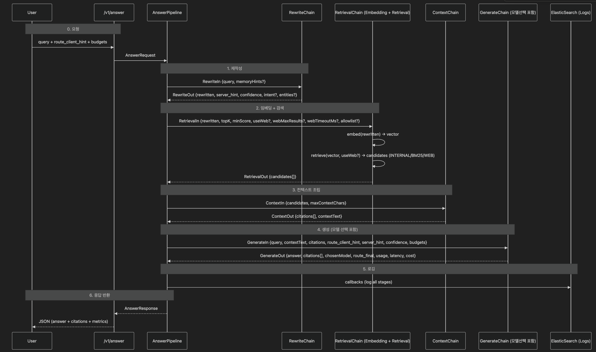

# 🥔 ChattyPotato

> **AI Hackathon 2025 | Team IA_X**  
> 혼합형 라우팅 기반 RAG 시스템 — *“최적의 모델을 똑똑하게 선택하고, 빠르게 대답한다.”*

---

## 🚀 프로젝트 개요

**ChattyPotato**는 LLM 기반 Q&A 시스템에 **하이브리드 라우팅(저비용 ↔ 고성능 모델 자동 분기)**을 결합한  
**RAG (Retrieval-Augmented Generation)** 파이프라인입니다.

> “질문을 이해하고, 문맥을 찾아, 가장 적절한 모델로 대답한다.”

### 🎯 주요 특징
- 🧠 **Retrieval**: 내부 + 웹 기반 문서 검색 (Vector + BM25)
- 🧩 **Augmentation**: 문서 요약 및 컨텍스트 조립
- ⚙️ **Generation**: 프롬프트 구성 + 모델 선택 + 응답 생성
- 🔀 **Routing**: 클라이언트 vs 서버 모델 자동 결정
- 📊 **Observability**: ElasticSearch 기반 전 단계 로깅

---

## 🧱 기술 스택

| 구분 | 기술 |
|------|------|
| **Backend** | Spring Boot 3.x, Java 21 |
| **LLM APIs** | AWS Bedrock (Titan Embeddings, Claude 3, Mistral), OpenAI GPT-4o |
| **Vector Store** | Elasticsearch Vector Index |
| **Observability** | ElasticSearch (Logs + TraceId), Micrometer, OpenTelemetry |
| **Async Handling** | CompletableFuture, Custom Executor |
| **Build/Deploy** | Gradle, Docker, AWS ECS Fargate |

---

## 🧭 전체 데이터 플로우



---

# Java_langchainLike 설계 및 책임 범위

## ⚙️ 1️⃣ RetrieveChain

**역할:** 질의 재작성 → 임베딩 → 문서 검색 (내부 + 웹)

**핵심 키워드:** *Query Understanding & Knowledge Retrieval*

### 📌 책임

| 범주 | 설명 |
| --- | --- |
| 🔤 **입력 정규화 / 재작성** | 사용자의 원문 query를 의미적으로 풍부하게 바꾸기 위해 LLM(cheap model)을 사용함.<br/>예: “제주 숙소 추천” → “제주 2박3일 저예산 숙소 추천 리스트 최신 정보” |
| 🧠 **임베딩(Embedding)** | 재작성된 질의를 벡터로 변환하여 의미 기반 검색을 수행함. |
| 📚 **지식 검색(Retrieval)** | **VectorStoreRetriever**: 벡터 유사도 기반 내부 문서 검색 |
| ⚖️ **결과 병합(ScoreMerger)** | 세 가지 검색 결과를 점수 기반으로 통합 후 후보(candidates[]) 생성. |

---

## 🧩 2️⃣ AugmentChain

**역할:** 검색 결과를 LLM이 이해할 수 있는 컨텍스트 블록으로 재구성

**핵심 키워드:** *Context Assembly & Citation Generation*

### 📌 책임

| 범주 | 설명 |
| --- | --- |
| ✂️ **문서 요약 / 스니펫 추출** | 각 candidate에서 핵심 문장만 뽑아내고, 과도한 텍스트는 제거함. |
| 🧱 **컨텍스트 블록 구성(Context)** | 여러 인용문을 묶어서 LLM에 전달할 **하나의 contextText** 문자열 생성. |

---

## 🤖 3️⃣ GenerateChain

**역할:** 컨텍스트 기반 답변 생성 + 모델 선택 + 비용/시간 측정

**핵심 키워드:** *LLM Reasoning & Routing Decision*

### 📌 책임

| 범주 | 설명 |
| --- | --- |
| 🧾 **프롬프트 조립** | 사용자 질의 + contextText + citations(예정)를 종합하여 답변용 Prompt 구성. |
| 🧠 **LLM 생성(Answer Generation)** | 선택된 모델로 답변을 생성하고, JSON 형식(답변, 인용, 메타데이터)으로 파싱. |
| ⏱️ **성능/비용 측정** | latency, token usage, cost 계산 후 응답 DTO에 포함. |

---

리트리벌 체인 → 현재 쿼리 리라이팅 → 임베딩 검색 → (vector & web검색)문서들 + 리라이팅된 쿼리 반환(DTO)

아구먼트 체인 → 문서 + 쿼리 → 하나의 질문 (문맥 섹터 + 질문섹터) → 문맥 섹터 제한에 맞게 문서 요약 (LLM)
→ 쿼리 섹터에 맞게 쿼리 요약(LLM) → 문맥 섹터 + 질문 섹터 컨텍스트 블럭(DTO)

제너레이트 체인 → 가공한 대화 문맥 생성 → llm에 보내기 → 받은 답변 저장(DTO)

---

## 토큰 제한 처리 과정

| 단계 | 처리 방식 | 설명 |
| --- | --- | --- |
| Retriever | 상위 N개 문서 제한 (`limit(10)`) | 빠른 컷 |
| AugmentedChain | `TokenCounter`로 토큰 누적 제한 | 안전 컷 |
| PromptAssembler | 전체 prompt 토큰 검증 | 최종 컷 |

## 최종 프롬프트 토큰 수

| 섹션 | 목적 | 토큰 수 (권장) | 비율 | 근거 |
| --- | --- | --- | --- | --- |
| 🟩 **System Prompt** | 모델 역할 정의 (“너는 여행 큐레이터야...”) | **150–250** | 10% | 짧지만 톤/역할 결정. 응답 일관성 확보용. |
| 🟦 **Rewrite Query** | 검색 및 라우터 입력용 핵심 문장 | **≤100** | 5% | BERT/BART 점수 비교의 기준. 짧을수록 라우팅 정확도 ↑ |
| 🟪 **Original Query (Reinjection)** | 원문의 뉘앙스·의도 복원 | **300–500 (최대 512)** | 20–25% | 긴 질문도 nuance 유지. 단, 500 넘으면 LLM context 압박. |
| 🟨 **Retrieved Context (Docs)** | 검색된 문서 요약/근거 제공 | **900–1200** | 45–50% | 문서당 512tokens 요약 × 2~3개. 정보 밀도 유지. |
| 🟥 **Instruction / Output Format** | JSON 응답 지시 or 스타일 지정 | **150–250** | 10% | 모델 출력을 구조화하기 위한 명시. |
| ⚪ **총합 (입력)** |  | **1800–2200 tokens** | 100% | 8k 모델 대비 25–30% 사용 → 안정 + 빠름 |

---

## 🏗️ 프로젝트 논리 아키텍처

```
                              사용자
                                │
                                ▼
                    aiRouter (Client-side)
                                │  route_client_hint / budgets
                                ▼
        ┌────────────────────────────────────────────────┐
        │            Pipeline Orchestrator               │
        │        /v1/answer  →  AnswerController         │
        │                  AnswerPipeline                │
        └────────────────────────────────────────────────┘
                                │  Chains 표준 I/O
        ┌───────────────┬───────┴────────┬───────────────┐
        ▼               ▼                ▼               ▼
  RewriteChain    RetrievalChain    ContextChain   GenerateChain
  rewritten,     Embedding +       citations,     모델선택 + JSON
  confidence,    Internal/Web      contextText    응답
  route_hint     Retrieval
                      │
        ┌─────────────┼──────────────┬─────────────┐
        ▼             ▼              ▼             ▼
  ScoreMerger  WebSearchRetriever BM25Retriever VectorStoreRetriever
                      │              │             │
                Web Search API  Keyword/BM25   Vector Store / KB
                                   Index

  Cross-Cutting
  ├─ Callback / Tracing Hooks
  ├─ Conversation / Vector Memory
  ├─ PromptTemplates 리소스
  ├─ Redis / Session & Prompt Cache
  └─ EsLoggingService → ElasticSearch Logs
```

- **Client-side aiRouter**: `route_client_hint`, 비용 budgets를 서버로 전달해 모델 결정에 힌트 제공
- **AnswerPipeline**: 네 개 체인을 표준 I/O로 묶는 Orchestrator. 각 체인은 DTO 입력 → DTO 출력 계약을 따름
- **Cross-Cutting**: 콜백/트레이싱, 메모리, 프롬프트 템플릿, Redis 캐시, ES 로깅이 모든 단계에 횡단 적용

---

## 📁 Spring 프로젝트 구조

```
src
├── main
│   ├── java/ia_x_ai_hackathon/chatty_potato
│   │   ├── ChattyPotatoApplication.java
│   │   ├── auth
│   │   │   └── controller/AuthController.java
│   │   ├── chatroom
│   │   │   ├── controller/ChatController.java
│   │   │   ├── document/ChatMessage.java
│   │   │   ├── dto/ChatRequest.java
│   │   │   ├── repository/ChatMessageRepository.java
│   │   │   └── service/ChatService.java
│   │   ├── common
│   │   │   ├── config/SecurityConfig.java
│   │   │   ├── exception/GlobalExceptionHandler.java
│   │   │   ├── filter/JwtAuthenticationFilter.java
│   │   │   ├── resolver/{UserArgumentResolver, UserId}.java
│   │   │   └── util/{FuturePoller, JwtUtil}.java
│   │   ├── config
│   │   │   ├── AsyncConfig.java
│   │   │   ├── ChatClientConfig.java
│   │   │   ├── ElasticsearchConfig.java
│   │   │   └── OpenAIEmbeddingConfig.java
│   │   └── rag
│   │       ├── controller/RAGController.java
│   │       ├── dto
│   │       │   ├── AugmentedContextDto.java
│   │       │   ├── EmbeddingResultDto.java
│   │       │   ├── LLMResponseDto.java
│   │       │   ├── PromptAssemblyDto.java
│   │       │   ├── RagResultDto.java
│   │       │   ├── RetrievedDocumentDto.java
│   │       │   ├── RewriteReqDto.java
│   │       │   ├── RewriteResDto.java
│   │       │   ├── RewriteResultDto.java
│   │       │   └── RouteReqDto.java
│   │       ├── entity/DocumentEntity.java
│   │       ├── exception
│   │       │   ├── PromptBuildFailedException.java
│   │       │   ├── PromptTimeoutException.java
│   │       │   ├── TaskNotFoundException.java
│   │       │   └── TimeoutException.java
│   │       ├── pipe
│   │       │   ├── RagPipelineService.java
│   │       │   └── chain
│   │       │       ├── AugmentedChainService.java
│   │       │       ├── GeneratorChainService.java
│   │       │       ├── RetrieverChainService.java
│   │       │       └── RewriteChainService.java
│   │       ├── repository/DocumentRepository.java
│   │       ├── service
│   │       │   ├── EmbeddingService.java
│   │       │   ├── SummarizationService.java
│   │       │   ├── TokenAllocationStrategy.java
│   │       │   ├── TokenCounter.java
│   │       │   └── VectorStoreService.java
│   │       └── store/InMemoryStore.java
│   └── resources/application.yml
└── test/java/ia_x_ai_hackathon/chatty_potato
    ├── ChattyPotatoApplicationTests.java
    └── rag
        ├── pipe/chain
        │   ├── AugmentedChainServiceTest.java
        │   ├── EmbeddingServiceTest.java
        │   ├── RagPipelineServiceTest.java
        │   ├── RetrieverChainServiceTest.java
        │   └── RewriteChainServiceTest.java
        └── service
            ├── SummarizationServiceTest.java
            ├── TokenAllocationStrategyTest.java
            └── TokenCounterTest.java
```

---

## 📌 RAG + AI Router 해커톤 회고

> *“기술 실험으로서의 성공, 완성도로서의 실패 — 그러나 학습으로서의 진짜 성장.”*

### 1️⃣ 프로젝트 개요

**🎯 목표**
- 검색증강생성(RAG) 구조로 질문을 재작성·검색·요약·응답하는 파이프라인 구현
- 비용 효율적 LLM 선택을 위한 **AI Router** 적용
- LangChain 구조의 장점을 **Spring Boot 환경에서 재현**

### 2️⃣ 잘한 점 / 강점

**🧠 기술적 도전**
- RAG, Hybrid LLM Routing, LangChain 등 고난도 AI 구조를 학습·구현
- Rewrite → Retrieval → Context → Generate 체인을 Spring 환경에서 실행 검증
- 비동기적으로 프롬프트를 수집해, 비용 정책에 따라 RAG 응답을 생성·저장하는 메서드 구현
  (`RagPipelineService#produce` — 데드라인-폴링으로 프롬프트 확보 → low/high 분기 → VectorStore 저장)

**📚 학습 및 협업 문화**
- LangChain 구조 원리를 문서화 후 Discord/Notion에 공유
- 레퍼런스 큐레이션 채널 운영 (논문, 문서, 코드 샘플)
- 회의록·결정사항 기록으로 팀 내 러닝 속도 상승

### 3️⃣ 아쉬운 점 / 비판적 분석

**⚠️ 스코프 관리 실패**
- 짧은 기간에 RAG + Router + Electron을 모두 구현하려다 MVP 완성도 부족
- 사용자 가치보단 구조 복잡도에 초점

**⚙️ 데이터 파이프라인 병목**
- 외부 API 동기 의존으로 데이터 수집·임베딩 속도 저하
- 컴퓨터 여러 대와 여러 개의 프로세스를 동시 실행해 어느정도 해결
  *(전체 10%의 데이터 수집에도 기본 3시간 이상 소요)*

**👥 협업·리스크 관리**
- 역할 분담은 있었으나 통합 주기가 늦어 빌드 실패로 연결
- 의사결정 로그 부족

**📊 정량화 부족**
- 성능을 감각적으로 평가 (“느림”)
- p95 latency / token cost 등의 수치화 부재

### 4️⃣ 핵심 교훈

| 구분 | 교훈 | 설명 |
| --- | --- | --- |
| 기술 | “모든 걸 한 번에 구현하려 하면, 아무것도 완성되지 않는다.” | 단계별 MVP 전략의 중요성 |
| 팀워크 | “지식 공유는 강했지만, 동기화는 약했다.” | 협업 주기 관리 필요 |
| 설계 | “성능은 코드를 고치기보다 구조를 고쳐야 나온다.” | 병목의 근본은 구조 |
| 성장 | “실패를 문서화하면 다음 사이클의 설계가 쉬워진다.” | Postmortem의 가치 |

### ✍️ 결론

이번 해커톤은 **“기술 실험으로서의 성공, 제품 완성도로서의 실패”** 였다.
그러나 RAG, LangChain, AI Router라는 복잡한 시스템을 직접 구현하며
**문제 해결력, 구조적 사고, 팀 학습 문화** 라는 세 가지 자산을 얻었다.

다음 목표는 단순하다 — *“작동하는 MVP로 기술을 증명하는 것.”*